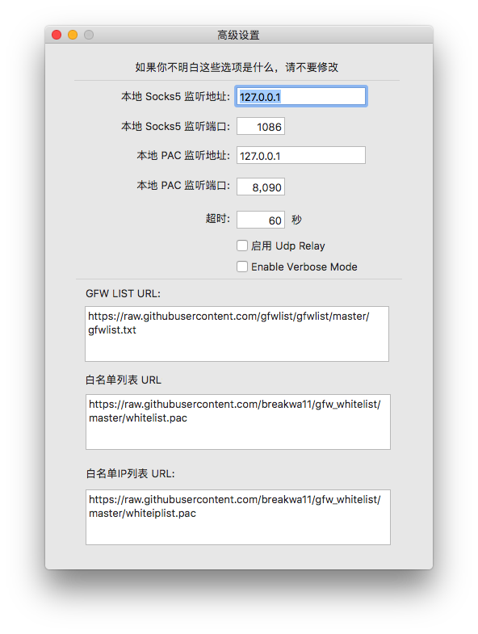

### vscode安装go插件
由于vscode安装插件是通过命令行执行go get的方式，如果包在github上还好，在golang.org上真的只能...

解决办法: 命令行走ss代理

- brew install privoxy
- 编辑/usr/local/etc/privoxy/config的内容
`listen-address 0.0.0.0:8118`
`forward-socks5 / localhost:1086 . #端口这里填写socks5代理的端口`


- 启动privoxy 
`sudo /usr/local/sbin/privoxy /usr/local/etc/privoxy/config`

- 在环境变量中加入代理开关函数

```
function proxy_off(){
    unset http_proxy
    unset https_proxy
    echo -e "已关闭代理"
}

function proxy_on() {
    export http_proxy="http://127.0.0.1:8118"
    export https_proxy=$http_proxy
    echo -e "已开启代理"
}
```

###### 需要安装的包
go get -u -v github.com/nsf/gocode
go get -u -v github.com/rogpeppe/godef
go get -u -v github.com/golang/lint/golint
go get -u -v github.com/lukehoban/go-find-references
go get -u -v github.com/lukehoban/go-outline
go get -u -v sourcegraph.com/sqs/goreturns
go get -u -v golang.org/x/tools/cmd/gorename
go get -u -v github.com/tpng/gopkgs
go get -u -v github.com/newhook/go-symbols